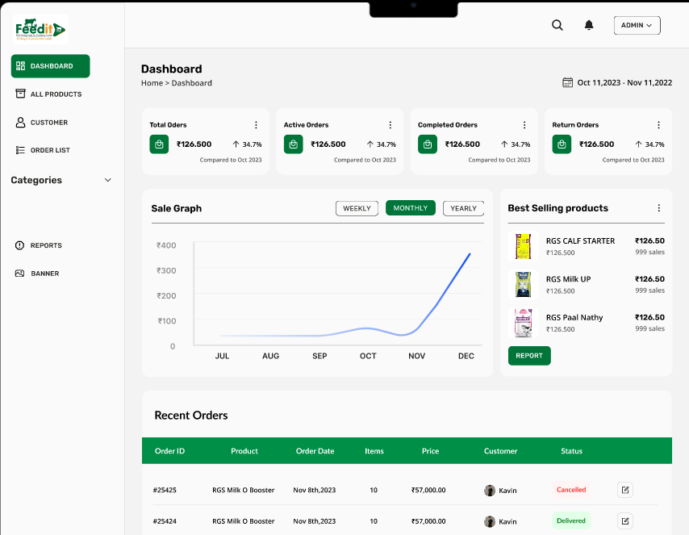

# 🐓 FeedIt Admin Panel – Scalable Dashboard for Animal Feed Management


> A pixel-perfect, fully responsive, and modular **Admin Dashboard** crafted for the **FeedIt Mobile App**, which manages the distribution and logistics of Cow 🐄, Goat 🐐, and Chicken 🐓 feed & supplements.  
> Built with **React**, **Vite**, **TypeScript**, **Tailwind CSS**, and **Firebase**, this dashboard provides a streamlined and modern admin experience.

---

## 📚 Table of Contents

- [🚀 Live Preview](#-live-preview)
- [📸 Screenshots](#-screenshots)
- [⚙️ Features](#️-features)
- [🛠️ Tech Stack](#-tech-stack)
- [📂 Folder Structure](#-folder-structure)
- [🧑‍💻 Pages](#-pages)
- [🚧 Roadmap](#-roadmap)
- [📦 Setup Instructions](#-setup-instructions)
- [🚀 Deployment](#-deployment)
- [🤝 Contributing](#-contributing)
- [📄 License](#-license)
- [📬 Contact](#-contact)

---

## 🚀 Live Preview

> 🎯 Coming soon on [Vercel](https://vercel.com)

---

## 📸 Screenshots

| DASHBOARD | ORDERS | CUSTOMERS |
|--------|-------|-----------|
|  |  |  |

---

## ⚙️ Features

- ✅ **Secure Auth Workflow**: Complete authentication flow with Login, Forgot Password, Email Verification, and Password Reset screens.
- 📊 **Insightful Dashboard Analytics**: Get a bird's-eye view of your business with summaries for orders, sales trends, best-selling products, and recent orders.
- 📦 **Efficient Order Management**: View, sort, and filter customer orders seamlessly and update their status on the fly.
- 🧑‍🌾 **Customer Monitoring**: Keep track of customer activity, recent signups, and manage user data effectively.
- 🖼️ **Dynamic Mobile Banner Uploader**: Easily update promotional banners displayed in the mobile app to engage your customers.
- 📱 **Fully Responsive Design**: A flawless experience across all devices, including Desktop 💻, Tablet 📱, and Mobile 📲.

---

## 🛠️ Tech Stack

| Layer       | Technology & Libraries         |
|-------------|--------------------------------|
| UI Framework| **React.js + Vite** ⚛️         |
| Language    | **TypeScript** 💬              |
| Styling     | **Tailwind CSS** 💨 + **Shadcn/UI** 🎨 |
| Routing     | **React Router DOM** 🧭        |
| Charts      | **Recharts** 📊                |
| Icons       | **Lucide Icons** 🧩            |
| Backend     | **Firebase** 🔥 (Auth + Firestore) |
| Hosting     | **Vercel** or **Netlify** 🌐   |

---

## 📂 Folder Structure

```
.
├── design/              # Screenshots of Application
├── public/              # Static assets (favicon, etc.)
├── src/
│   ├── components/      # Reusable UI components (Header, Sidebar, etc.)
│   ├── data/            # Static or mock data for development
│   ├── hooks/           # Custom React hooks (e.g., use-mobile)
│   ├── layout/          # Auth & Main layout wrappers
│   ├── lib/             # Firebase config, utility functions
│   ├── pages/           # All application pages/routes
│   ├── services/        # Firebase-related services
│   └── main.tsx         # Application entry point
├── .env.example         # Example environment variables
├── LICENSE              # MIT License file
├── package.json         # Project dependencies and scripts
├── tailwind.config.ts   # Tailwind CSS configuration
└── vite.config.ts       # Vite project configuration
```

---

## 🧑‍💻 Pages

### Authentication Flow
- `/`: Splash Screen
- `/login`: Email/Password Login
- `/forgot-password`: Forgot Password Form
- `/email-sent`: Confirmation for Password Reset Email
- `/set-new-password`: Form to Set a New Password
- `/password-changed`: Confirmation of Password Change

### Core Application
- `/dashboard`: Main dashboard with stats, charts, and summaries.
- `/products`: Product management (CRUD functionality is planned).
- `/orders`: Order management table.
- `/customers`: Customer insights and user list.
- `/banners`: Banner upload and preview interface.

### Utilities
- `*`: A `NotFound` page to handle 404 errors gracefully.

---

## 🚧 Roadmap

-   [ ] **Full Product CRUD**: Implement Create, Read, Update, and Delete functionality for products.
-   [ ] **Advanced Order Management**: Add filtering, sorting, and search capabilities to the orders table.
-   [ ] **User Roles & Permissions**: Introduce Admin and Sub-user roles with different access levels.
-   [ ] **Real-time Notifications**: Implement notifications for new orders and low inventory alerts.
-   [ ] **In-depth Analytics**: Create an advanced analytics page for sales, user behavior, and more.
-   [ ] **Testing**: Write unit and integration tests to ensure code quality and stability.

---

## 📦 Setup Instructions

### Prerequisites
-   Node.js v18+
-   `npm` package manager
-   A [Firebase](https://firebase.google.com/) account

### 🔧 Installation

1.  **Clone the repository:**
    ```sh
    git clone https://github.com/karthi-AI-hub/Feedit-Admin.git
    cd Feedit-Admin
    ```

2.  **Install dependencies:**
    ```sh
    npm install
    ```

### 🔥 Firebase Setup

1.  Go to the [Firebase Console](https://console.firebase.google.com/) and create a new project.
2.  Add a new Web App to your project.
3.  Copy the `firebaseConfig` object provided.
4.  Create a `.env` file in the root of your project and add your Firebase configuration keys. You can copy from `.env.example` if it exists.
    ```env
    VITE_API_KEY="YOUR_API_KEY"
    VITE_AUTH_DOMAIN="YOUR_AUTH_DOMAIN"
    VITE_PROJECT_ID="YOUR_PROJECT_ID"
    VITE_STORAGE_BUCKET="YOUR_STORAGE_BUCKET"
    VITE_MESSAGING_SENDER_ID="YOUR_MESSAGING_SENDER_ID"
    VITE_APP_ID="YOUR_APP_ID"
    ```
5.  The `src/lib/firebase.ts` file is already set up to use these environment variables.

### ▶️ Run the Application

```sh
npm run dev
```
The application will be running at `http://localhost:{PORT}`.

---

## 🚀 Deployment

### Deploying to Vercel

1.  Install the Vercel CLI:
    ```sh
    npm install -g vercel
    ```
2.  Login to Vercel:
    ```sh
    vercel login
    ```
3.  Deploy the project:
    ```sh
    vercel
    ```

### Deploying to Netlify

1.  Install the Netlify CLI:
    ```sh
    npm install -g netlify-cli
    ```
2.  Login to Netlify:
    ```sh
    netlify login
    ```
3.  Deploy the project:
    ```sh
    netlify deploy
    ```

---

## 🤝 Contributing

Contributions, issues, and feature requests are always welcome!
Here’s how you can contribute:

1.  **Fork** the project.
2.  Create your feature branch (`git checkout -b feature/AmazingFeature`).
3.  **Commit** your changes (`git commit -m 'Add some AmazingFeature'`).
4.  **Push** to the branch (`git push origin feature/AmazingFeature`).
5.  Open a **Pull Request**.

---

## 📄 License

This project is licensed under the **MIT License**. See the [LICENSE](./LICENSE) file for more details. You’re free to use, modify, and distribute this project with attribution.

---

## 📬 Contact

-   **Author:** Karthikeyan S
-   **Email:** [karthikeyanks463@gmail.com](mailto:karthikeyanks463@gmail.com)
-   **Website:** Coming Soon

---

<p align="center">
  🐓 Made with passion for Feed Management ✨
</p>